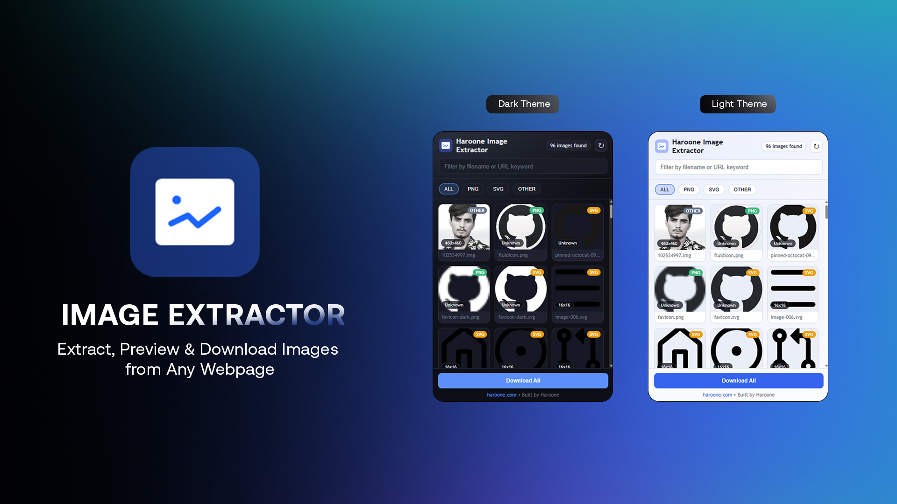

# Haroone Image Extractor

A Chrome Extension to extract images from the current webpage, preview them, and download them individually or as a ZIP.

Built by Haroone.

## Features

- Extracts images from:
  - `img` tags (`src`, `srcset`, lazy-loading attributes)
  - `picture` / `source` elements
  - CSS background images (inline + computed styles)
  - Inline SVG and SVG image sources
  - Canvas (`toDataURL`) exports
  - Shadow DOM trees
  - Same-origin iframes
  - Open Graph and Twitter meta image tags
  - JSON-LD image fields
  - Favicons and Apple touch icons
- URL normalization to absolute URLs
- Deduplication of duplicate URLs
- Format detection (`jpg`, `png`, `svg`, `gif`, `webp`, `ico`, `avif`, `bmp`, `other`)
- Fast popup image grid with search and format filters
- Single image download
- `Download All` as ZIP
- Per-image URL copy action
- Auto theme support (light/dark based on browser/system)
- Filter buttons auto-hide when no images exist for that type

## Screenshots




## Install (Unpacked)

1. Open Chrome: `chrome://extensions`
2. Enable `Developer mode`
3. Click `Load unpacked`
4. Select the extension folder:
   - `E:\Chrome Extension\haroone-image-extractor`

## Usage

1. Open any webpage.
2. Click **Haroone Image Extractor** in the Chrome toolbar.
3. Wait for scan to complete.
4. Use search/filter if needed.
5. Download an image from each card, or click **Download All** to export ZIP.

## Permissions

- `activeTab`: Access current tab context
- `scripting`: Inject scanner script when needed
- `downloads`: Save images/ZIP files
- `storage`: Reserved for extension state/settings
- Host permissions: `<all_urls>` for page image extraction

## Privacy

- No backend/server calls for analytics or tracking.
- Image processing happens in the browser/extension context.
- Downloads are triggered by explicit user actions.

## Project Structure

```text
haroone-image-extractor/
├── manifest.json
├── background.js
├── content.js
├── popup.html
├── popup.js
├── popup.css
├── icons/
│   ├── icon16.png
│   ├── icon32.png
│   ├── icon48.png
│   ├── icon64.png
│   ├── icon128.png
│   └── logo.svg
└── libs/
    └── jszip.min.js
```

## Build / Package

To create a release ZIP for upload:

- Current package name:
  - `E:\Chrome Extension\haroone-image-extractor.zip`

You can also package manually from the extension folder root.

## Publish to Chrome Web Store

1. Register a developer account (one-time fee).
2. Upload `haroone-image-extractor.zip` in the dashboard.
3. Complete store listing, privacy declarations, and distribution settings.
4. Submit for review.

## Development Notes

- Manifest Version: `3`
- Tech: Vanilla JavaScript + CSS
- ZIP generation: bundled `JSZip` (`libs/jszip.min.js`)

## License

Choose a license and add a `LICENSE` file (MIT is a common choice).


